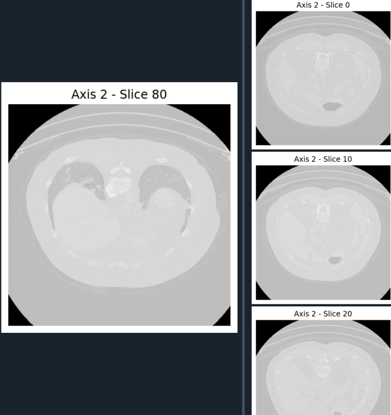
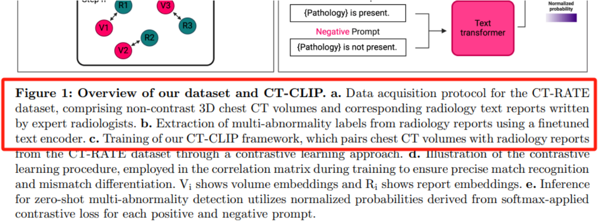
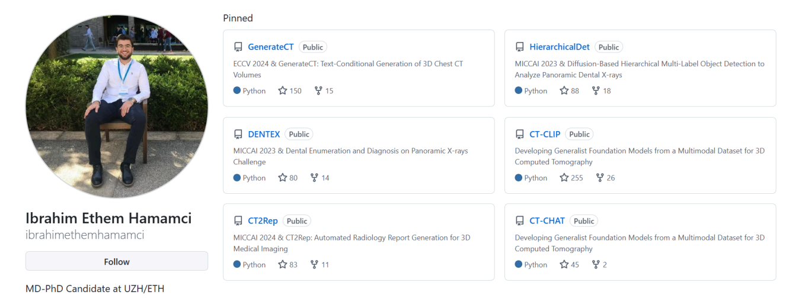
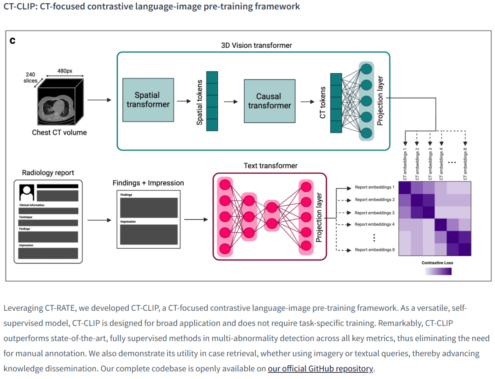
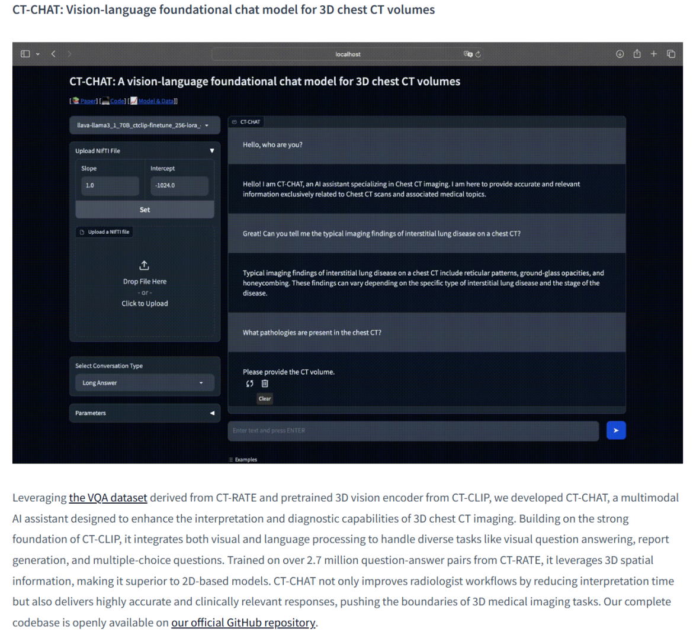

## 1. Are there ROIs?

- I carefully read the README document.

  > CT-RATE consists of 25,692 non-contrast chest CT volumes ... along with corresponding radiology text reports, multi-abnormality labels, and metadata.

  - There is no mention of segmentation annotations or bounding box/detection annotations.

- I also checked one of the images from the dataset.

  

  - I didn’t see any segmentation boundaries or masks, which means the image doesn’t come with segmentation labels.

**Therefore, the CT-RATE dataset does not contain explicit ROI annotations. The labels are at the image level, describing the presence or absence of abnormalities, which makes it unsuitable for segmentation tasks.**

------

## 2. Diagnosis (Benign or Malignant)?

- I looked at the label file: `train_label_summary.xlsx`. It indicates whether certain structures are present in the CT scan.
  - It includes labels like `Spleen`, `Kidney R / Kidney L`, `Gallbladder`, `Liver`, etc.
  - These are simply marked as `True/False`.
- I also checked `train_predicted_labels.csv`, which includes predicted labels for the presence of certain clinical abnormalities.
  - Labels include: `Medical material`, `Arterial wall calcification`, `Cardiomegaly`, etc.
  - Values are in `0/1` format, indicating absence or presence.
  - Some fields hint at regions of interest, such as:
    - `Lung nodule`: presence of nodules, but no benign/malignant info;
    - `Lung opacity`: indicates abnormality, but not clearly diagnosed;
    - `Pleural effusion`: abnormal fluid in the pleural space.
  - These labels only tell if something abnormal exists, not where or what kind it is.

**The CT-RATE dataset does not provide benign or malignant diagnosis labels. The label and metadata are based on radiology reports, but do not include judgment about the nature of findings. So, the dataset is not suitable for benign/malignant classification tasks.**

------

## 3. Radiologist or Biopsy?

- I checked `Metadata_Attributes.xlsx` for metadata field descriptions.

  - There are no fields like: `biopsy`, `label_source`, `pathology`, or `confirmed_by`.
  - The metadata only includes information like scanner model, slice thickness, and resolution.

- I also reviewed the paper “Developing Generalist Foundation Models from a Multimodal Dataset for 3D Computed Tomography”:

  

  - It mentions that “labels are extracted from radiology reports,” meaning they are weak labels generated from descriptive language by radiologists.

**The CT-RATE dataset uses labels automatically extracted from radiology reports through NLP. These labels are based on radiologists’ reports, not biopsy results. So, the label reliability depends on the radiologists’ interpretation and is considered weak supervision.**

------

## 4. Classification / Segmentation / Detection?

- I checked `train_predicted_labels.csv`.
  - Each row looks like: `VolumeName, label_1, label_2, ..., label_n`, and label values are `0` or `1`;
  - This is a typical **multi-label classification** format, where each sample may have multiple labels.
- As mentioned before, the dataset doesn’t include masks for segmentation or coordinates for detection tasks.

**So, the CT-RATE dataset is best suited for multi-label classification and image-text contrastive learning. It is not suitable for object detection or segmentation tasks due to the lack of ROI coordinates or masks.**

------

## 5. What are people using this dataset for?

- CT-RATE is a large-scale multimodal 3D medical imaging dataset. The authors have already used it for several tasks and released corresponding model frameworks and code.

- I visited the author’s GitHub page and found many projects using the CT-RATE dataset.

  

- **CT-CLIP: Contrastive Pretraining with Image and Text**

  

  - According to the official description, this is an unsupervised or weakly-supervised contrastive learning task using “image + report” pairs.

- **CT-CHAT: Visual Question Answering (VQA)**

  

  - This is a VQA task using both image and text inputs through a multimodal transformer.

- MICCAI 2024 & CT2Rep: Automated Radiology Report Generation for 3D Medical Imaging.

- GenerateCT: Text-Conditional Generation of 3D Chest CT Volumes.

**The CT-RATE dataset has already been widely used for image-text contrastive learning, radiology report generation, multimodal Q&A tasks, and conditional image generation. The official team has released open-source implementations for multiple tasks.**